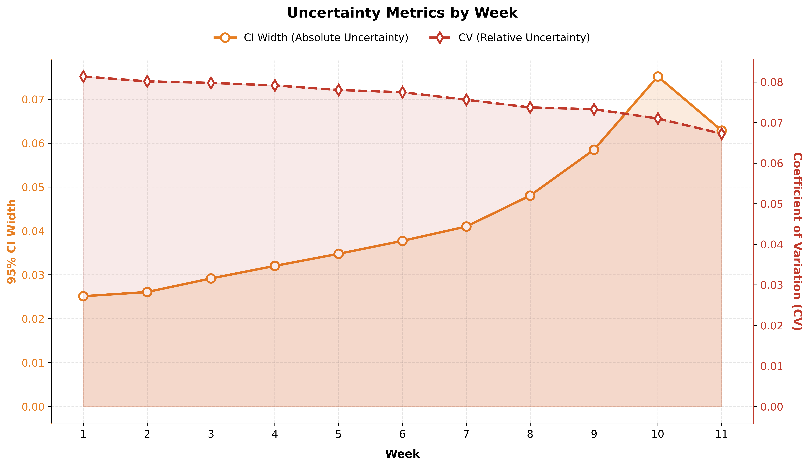
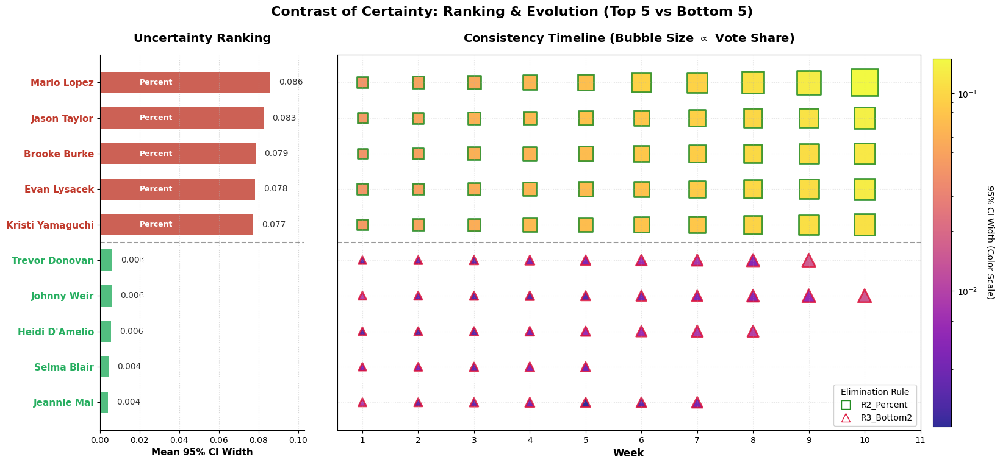

# 规则感知的动态Plackett–Luce模型

为了更好的推导粉丝投票的行为，我们设计了一种基于规则感知的动态Plackett–Luce模型（Rule-aware Dynamic Plackett–Luce Model, RDPLM），该模型能够同时捕捉粉丝投票的偏好、偏好的时间变化趋势以及比赛规则对排名的影响，具有较强的解释性和预测能力，以下是该模型的架构图片：

## 模型构建

### 核心投票模型：动态Plackett–Luce

在DWTS比赛中，粉丝投票的结果会与专家评价相结合，决定选手的淘汰时间和最终排名，由此形成的排序数据正是我们建模所拟合的目标。由于真实粉丝票数属于保密信息，数据中并不存在可直接监督的“投票总数”标签，因此我们将本问题表述为：在每周参数选手中，会有一个决定观众支持度的潜在变量，该变量与专家评价结合，最终产生观测到的淘汰结果。

Plackett–Luce（PL）模型是排序数据的经典概率生成模型，常用来给多个候选项的排序结果定义概率的分布。在PL模型中，会给定 m 个候选项，每个候选项 i 关联着一个非负吸引力参数，来代表该候选项的相对偏好程度 $\alpha_i$，然后，在 Luce 选择公理下，对于仍在场的选手集合 $S_t$,能够自然产生一个在集合上归一化的概率分布 $\{P(j \mid S_t)\}_{i \in S_t}$,即代表候选项在所有偏好中的相对份额。在本问题中，PL分布则可解释为选手在该周获得的相对观众投票份额为 $w_t$,而$P(j \mid S) = \frac{w_j}{\sum_{i \in S} w_i}$中概率最小的项即为被淘汰的选手。

进一步的，DWTS中观众的偏好并不是固定不变的，而是会随着赛季、周次等时间因素不断发生变化。此外，在变化的同时，每一个选手的真实实力和粉丝基础在一段时间内会保持相对稳定。因而，为刻画这种时间演化特征，我们参考了 Vladimír Holý 等人提出的动态Plackett–Luce模型，让每个选手的粉丝吸引力参数随着时间动态演化，以捕捉观众的偏好变化过程

具体来说，我们令每位选手在第t周的吸引力参数 worth 为 $w_{i,t} > 0$，并在对数尺度上建模其动态演化过程，即令

$$
\eta_{i,t} = \log w_{i,t}
$$

在此基础上，我们定义了一个带惯性的状态方程，使 $\eta_{i,t}$ 在周次上平滑变化，并同时允许外生信息对其产生影响。

$$
\eta_{i,t} = \begin{cases} 
\rho \eta_{i,t-1} + (1 - \rho)\alpha_i + \beta^{\top} x_{i,t} + \varepsilon_{i,t}, & t > 1 \\
\alpha_i + \beta^{\top} x_{i,t} + \varepsilon_{i,t}, & t = 1
\end{cases}
$$

其中，$\rho$表示人气的惯性，若$\rho$越大，则上周选手的人气对于这周的影响也就越大，表明了选手粉丝群体的延续。若$\rho$越小，则表明历史惯性作用更小。$\alpha_i$表示选手的长期基线人气，它是静态的变量，代表着选手参加节目之前就具有的粉丝数和人气值。$x_{i,t}$代表着目前的人气值，它由选手在比赛期间的 google trends 统计得到，为每周一次统计，能够反映选手的实时人气，而 $\beta$则代表着该目前人气值对于整体粉丝吸引力的影响。$\varepsilon_{i,t}$表示突发事件或噪声等随机性因素，在训练的过程中，我们对其做了L2先验式正则，以避免它吞噬结构参数的解释力。在每一周的$\eta$值计算完成后，我们都会对齐进行中心化处理，以防止某些选手的绝对值过高而掩盖了相对变化的规律。

$$
\tilde{\eta}_{i,t} = \eta_{i,t} - \frac{1}{n_t} \sum_{j \in \mathcal{A}_t} \eta_{j,t},
$$

最后，定义DWTS节目中仍剩余的选手集合为 $S_t$，则对于在场的所有选手，我们可以用 softmax 函数计算出该周每个选手所占有的相对粉丝票数的份额，即可得到每位选手在该周所得投票的百分比 $p_{i,t}^V$。

$$
p_{i,t}^V = \frac{w_{i,t}}{\sum_{j \in S_t} w_{j,t}} = \frac{\exp(\eta_{i,t})}{\sum_{j \in S_t} \exp(\eta_{j,t})}
$$

### 规则概率化

根据动态Plackett-Luce模型，我们为每一周t的在场选手集合 $S_t$ 生成了一个观众投票份额的百分比分布，然而，DWTS的实际淘汰规则却更为复杂，单纯用百分比分布无法模拟 Rank 合并的规则。因此，为了使模型可以根据可观测的淘汰结果 $E_t$ 对不可观测的 $p_t^V$进行反演估计，我们要将这些规则写成一个可微分的概率映射，即将其转换为决定淘汰结果的概率分布，将其定义为：

$$
\boldsymbol{\pi}_t = \{\pi_t(i)\}_{i \in S_t}, \quad \pi_t(i) = \mathbb{P}(E_t = i \mid \mathbf{p}_t^V, \mathcal{J}_t, \text{Rule}_t),
$$

其中，$\mathcal{J}_t$表示该周的评委打分信息，$\mathbf{p}_t^V$ 表示待预测的该周观众投票百分比分布，$\text{Rule}_t$表示这一季度所使用的淘汰规则。在此基础上，我们即可通过负对数似然来对模型进行训练。

#### Percentage规则定义

在R2规则下，节目会直接将评委得分与观众投票得分转换为百分比后相加，组合得分最低者即被淘汰。在此，我们记评委得分百分比为 $\mathbf{p}_t^J$，则组合后的得分为

$$
C_{i,t} = \mathbf{p}_{i,t}^J + \mathbf{p}_{i,t}^V
$$

最终淘汰者为得分最低者，即可对 $-C$ 作 softmax 归一化，得到淘汰概率：

$$
\pi_t(i) = \frac{\exp \left( -\kappa_{\text{pct}} C_{i,t} \right)}{\sum_{j \in S_t} \exp \left( -\kappa_{\text{pct}} C_{j,t} \right)},
$$

其中，$\kappa_{\text{pct}}$ 是一个温度参数，用于控制概率分布的“硬度”，即 $\kappa_{\text{pct}}$ 越大，淘汰概率越符合硬性规则，$\kappa_{\text{pct}}$ 越小，则淘汰的分布会越分散，反映更强的随机性。以此来防止部分选手得到的分数过低，而导致的模型不可导、梯度消失等问题，后文定义的 $\kappa_{\text{rank}}$、$\kappa_{\text{b2}}$ 也具有相同的作用。

#### Rank合并规则定义

排名本质上是一种离散化数据，无法直接用于梯度计算，因此我们需要在保证规则符合排名机制的基础上，将其转换为一个连续的、可微分的概率分布。例如，Grover等人在NeuralSort中的做法是，将原先不可导的离散数据用“连续松弛(continuous relaxation)”来实现端到端的梯度优化，并用温度参数控制近似程度，从而在保持排序语义的同时获得可导的训练目标。我们借鉴了这种方法，在观众端如下变化过程：

$$
u_{i,t}^V = -\log(p_{i,t}^V + \epsilon), \\
\hat{u}_{i,t}^V = \text{z-score}(u_{i,t}^V)=\frac{u_{i,t}^V - \overline{u_t^V}}{\text{std}(u_t^V) + \epsilon}, \\
v_{i,t}^V = \sigma(\hat{u}_{i,t}^V) = \frac{1}{1 + \exp(-\hat{u}_{i,t}^V)} \in (0, 1)
$$

首先，由于投票份额越小，则会越危险，但原本的投票份额数据$p_{i,t}^V$可能存在多个粉丝投票额比例差距过小的情况，无法有效区分危险程度。因此我们对投票份额取负对数，以强化在低票数区间的区分度，并将数值进行了翻转。然后，我们再将其进行z-score标准化，将该值其转换为在周内所有选手中的相对位置量，以保证数据的相对差距。最后，我们调用sigmoid函数，将标准化后的风险映射到0-1区间，形成一个可融合的“风险比例”。

并且，以上所有变换都是线性变换过程，因而并不会改变数据大小的相对位置关系，仅仅是对齐进行了放缩和翻转，从而在数值上保证排名的顺序，同时也通过线性变换放大了投票之间的差距，使得最终值$v_{i,t}^V$越大，越危险，从而模拟出了基于排名的投票值。

评委得分的排名可以根据每周的评委平均分数经过排序得到，定义为 $r_{i,t}^J \in \{1, \dots, |S_t|\}$，其数值越大表明排名越靠后，为与观众端的$v_{i,t}^V$保持一致，我们使用了线性归一化方法进行放缩。

$$
v_{i,t}^J = \frac{r_{i,t}^J - 1}{|S_t| - 1} \in [0, 1].
$$

最后，我们将两个值进行求和，得到了连续风险，从而作为Rank规则的淘汰风险值：

$$
R_{i,t} = v_{i,t}^V + v_{i,t}^J
$$

在此基础上，对于season1到season2的单纯Rank排序规则，即可直接对 $R_{i,t}$ 进行排序 softmax 操作，并添加 $\kappa_{\text{pct}}$ 作为温度参数。从而得到淘汰分布：

$$
\pi_t(i) = \frac{\exp \left( \kappa_{\text{rank}} R_{i,t} \right)}{\sum_{j \in S_t} \exp \left( \kappa_{\text{rank}} R_{j,t} \right)}.
$$

#### Bottom-2 规则定义

season28-season34的规则包含两个连续的过程：即先选出bottom-2，再由评委在bottom-2中进行淘汰选择。为刻画该过程，我们构造了两阶段模型，并对bottom-2进行边缘化，从而得到了最终的 $\pi_t(i)$。

首先，我们延续先前 rank 规则的连续风险 $R_{i,t}$，定义它的正权重为：

$$
a_{i,t} = \exp(\kappa_{b2} R_{i,t}), \quad A_t = \sum_{k \in S_t} a_{k,t},
$$

在其中，$\kappa_{b2}$为bottom-2规则的温度参数。我们采用 Plackett-Luce 的无方回抽样机制，任意无序对 $(i,j)$ 被选中为bottom-2的概率为：

$$
\mathbb{P}(\{i, j\} \text{ is bottom-2}) = \frac{a_{i,t}}{A_t} \frac{a_{j,t}}{A_t - a_{i,t}} + \frac{a_{j,t}}{A_t} \frac{a_{i,t}}{A_t - a_{j,t}},
$$

在此基础上，我们进入了第二阶段，即评委投票投出淘汰结果。具体过程是，对于给定的 bottom-2 无序对 $(i,j)$，我们先找到这两人对应的评委投票总分记为 $J_{i,t}$ 和 $J_{j,t}$，记录评委人数为$m$，我们采用逻辑函数来描述“单个评委投票淘汰i的概率为:

$$
q_{i \leftarrow j,t} = \sigma(\text{bias} + \gamma(J_{j,t} - J_{i,t})),
$$

其中，$\gamma > 0$ 为评委对分差的敏感度，bias为系统性偏置，来吸收评委可能保守或激进的误差。则在独立同分布投票假设下，多数票淘汰i的概率为二项分布尾和：

$$
\mathbb{P}(\text{elim } i \mid \{i, j\}) = \sum_{k=\lceil m/2 \rceil}^{m} \binom{m}{k} q_{i \leftarrow j, t}^k (1 - q_{i \leftarrow j, t})^{m-k}.
$$

则最终的淘汰概率为对所有可能的 bottom-2 配对求和：

$$
\pi_t(i) = \sum_{j \in S_t \setminus \{i\}} \mathbb{P}(\{i, j\} \text{ is bottom-2}) \cdot \mathbb{P}(\text{elim } i \mid \{i, j\}).
$$

由此，我们遵循了比赛两阶段的机制，同时也保证了端到端的可微性，从而能够对这些规则参数与PL模型参数一并通过NLL估计，实现模型的联合优化。

### 训练目标与求解

在训练目标与求解过程中，我们抓住用淘汰结果反推观众票份额这一核心，对于出现选手中途推出的情况，我们将其视为脏数据，将其排除在淘汰结果和训练的过程之外。并且，通过对DWTS节目背景调研，我们发现，每周淘汰多少人是节目的随机行为，因而我们针对多淘汰周，则采用“无放回”的方式对淘汰集合逐个计入对数似然并重新归一化，而对于无淘汰周，则令该周对似然不贡献损失，但动态递推仍持续更新 $\eta_{i,t}$。从而保证多人淘汰过程中语义的一致性。

为方便表述，记全体的待估参数为

$$
\Theta = \{ \underbrace{\alpha_i, \rho, \beta, \varepsilon_{i,t}}_{\Theta_{\text{vote}}}, \underbrace{\omega, \kappa_{\text{pct}}, \kappa_{\text{rank}}, \kappa_{b2}, \gamma, \text{bias}}_{\Theta_{\text{rule}}} \}.
$$

其中，$\Theta_{\text{vote}}$决定动态Placket-Luce产生的观众票份额$p_t^V$，$\Theta_{\text{rule}}$则将粉丝投票比例和裁判分数 $(p_t^V, \mathcal{J}_t)$ 映射为与赛季规则一致的淘汰概率。真实信号则建立在每周可观测的淘汰结果 $E_t$ 上。模型的优化目标即是：使得真实的淘汰者在规则意义下更危险，即最大化真实淘汰者的淘汰概，从而得到能解释淘汰结果的粉丝票份额 $p_t^V$。

并且，我们也对基线人气 $\alpha_i$、趋势系数 $\beta$ 与周冲击项 $\varepsilon_{i,t}$ 加 L2 正则，尤其约束 $\varepsilon_{i,t}$，防止其吞噬结构参数的解释力。

优化方法采用了Adam进行端到端的梯度学习，并用可微约束保证了参数含义与稳定性：$\rho, \omega$ 用 sigmoid 约束在 $(0,1)$，温度/敏感度参数 $\kappa_{\text{pct}}, \kappa_{\text{rank}}, \kappa_{\text{b2}}, \gamma$ 用 softplus 保证为正。并且，在训练过程中配合梯度递减与早停机制来保存最优模型，实验发现，在训练约550轮后模型得到收敛，完成了模型的训练。

经过训练，我们最终得到的关键参数包括：$\rho$（人气惯性）、$\alpha_i$（基线人气）、$\beta$（趋势影响）、$\omega$（评委与观众权重）、各规则温度 $\kappa$（规则“硬度”）。采用这些参数，我们最终得到了接近历史真实情况的粉丝票份额 $p_t^V$。

## 模型输出与参数解释

通过上述的描述，我们成功建立并训练了我们的模型，为每一个选手生成了其在不同周的粉丝票份额 $p_t^V$。并且，我们还得到了模型的可解释性参数取值，部分关键的可解释性参数如下：

| 参数                     | 含义（你论文里的解释口径）                               | 作用位置               | 约束/尺度                      | 训练后取值（本次）                                          |
| ---------------------- | ------------------------------------------- | ------------------ | -------------------------- | -------------------------------------------------- |
| $\alpha_{s,i}$         | 选手 $i$ 在赛季 $s$ 的**长期基线人气**（先验粉丝盘/稳定偏好）      | 动态状态方程             | 实数；每季一组向量                  | **非单值**：每季每人一个 $\alpha$，存于模型参数中                    |
| $\rho$                 | **人气惯性**：上周 $\eta_{t-1}$ 对本周 $\eta_t$ 的延续强度 | 动态状态方程             | $(0,1)$（sigmoid）           | **0.9279**                                         |
| $\beta\in\mathbb R^3$  | 趋势协变量系数：衡量外生热度对人气的边际影响                      | 动态状态方程             | 实数向量                       | **[0.0145,\ -0.0228,\ -0.0000]**（对应下表 $x$ 的 3 个特征） |
| $\varepsilon_{s,i,t}$  | **周冲击/残差项**：吸收不可观测扰动（爆点/争议/突发事件等）           | 动态状态方程             | 实数；每季矩阵 $n_s\times(T_s+1)$ | **非单值**：每季每周每人一个 $\varepsilon$，受 L2 先验约束           |
| $\omega$               | **评委权重**：风险融合中评委端相对权重（R1/R3 共享）             | Rank/Bottom-2 风险融合 | $(0,1)$（sigmoid）           | **0.1981**                                         |
| $\kappa_{\text{pct}}$  | R2（Percent）规则温度：控制“组合分最低者淘汰”的硬度             | R2 softmin/softmax | $>0$（softplus）             | **6.9196**                                         |
| $\kappa_{\text{rank}}$ | R1（Rank）规则温度：控制“风险最大者淘汰”的硬度                 | R1 softmax         | $>0$（softplus）             | **2.5886**                                         |
| $\kappa_{b2}$          | R3 Bottom-2 温度：控制进入 bottom-2 的“分离强度”        | R3 配对边缘化           | $>0$（softplus）             | **2.6286**                                         |
| $\gamma$               | R3 评委“分差敏感度”：分差越大越倾向淘汰低分者                   | R3 评委投票模型          | $>0$（softplus）             | **0.7490**                                         |
| $\text{bias}$          | R3 评委投票截距：吸收制度性偏置（保守/激进倾向）                  | R3 评委投票模型          | 实数                         | **-0.3961**                                        |

从人气惯性参数 $\rho=0.9279$ 可以看出，选手的人气具有很强的惯性，即上周的粉丝票数对本周的粉丝票数有很强的影响，这说明，现实中每位选手通常具有相对固定的粉丝群体，其粉丝的投票行为具有很强的连续性。而 google trends 系数 $\beta$ 的两个分量分别为0.0145和-0.0228，我们会在后文第三问详细讨论它们的影响。

对于规则参数而言，三种不同规则的温度系数分别为 2.5886, 6.9196, 2.6286，其中，percentage值较大，说明模型在训练过程中将其看作了硬约束，与“分数更低”者淘汰的规则基本一致；而rank规则的值较小，说明在历史数据中存在更多“非分数因素”的扰动，这些扰动可能来自于评委的主观判断、节目效果的临时变化等。对于bottom-2规则而言，分差敏感度 $\gamma=0.7490$，说明在历史数据中，当分差较大时，评委更倾向于淘汰低分者。

## 一致性检验

为回答问题w1中，模型估计的粉丝票数结果是否与实际情况一致，我们在模型训练收敛后，将由动态PL模型得到的观众票数份额 $\hat{p}_t^{V}$ 输入了我们定义的规则概率化模块，获得了该周的“淘汰分布”:

$$
\hat{\boldsymbol{\pi}}_t = \{\hat{\pi}_t(i)\}_{i \in S_t}, \quad \hat{\pi}_t(i) = \mathbb{P}(E_t = i \mid \hat{\mathbf{p}}_t^V, \mathcal{J}_t, \text{Rule}_t).
$$

随后，我们会把 $\hat{\pi}_t(i)$ 视为谁会被淘汰的概率分布，并将其与真实的淘汰结果 $E_t$ 进行一致性评估。我们发现，模型预测的淘汰概率与实际淘汰结果的符合率约为92.79%，说明模型很好的学习到了真实的淘汰分布。

但是，规则的概率化模块只是对于规则的模拟，无法体现出实际的淘汰情况。因此我们对结果还采用了模拟现实的评估方式，根据实际的 rank、percentage和bottom-2规则，进行真实的数值排名转换和计算，得出现实意义下每个选手被淘汰的结果，并与实际的淘汰结果进行比较。以下是几个赛季的模拟结果举例：

此外，我们还定义了检验淘汰结果的一致性指标，包括Hit@1、Hit@2和Log Score，用于评估模型预测的淘汰结果与实际淘汰结果的匹配程度。Hit@1表示模型预测的淘汰概率最大的选手与真实情况的匹配程度、Hit@2表示模型预测的淘汰概率最大的两名选手中是否包含真实淘汰的选手、Log Score表示模型给真实淘汰者分配的概率有多大，指标公式与评估结果如下所示。

$$
\text{Hit@1}_t = \mathbb{1} \{ \text{rank}_t[0] \in E_t \}.
\\
\text{Hit@2}_t = \mathbb{1} \{ E_t \cap \{ \text{rank}_t[0], \text{rank}_t[1] \} \neq \varnothing \}.
\\
\text{log\_score}_t = \log(\hat{\pi}_t(e) + 10^{-10}) \le 0,
$$

| 规则                    |    评估周数 |  Hit@1(%) |  Hit@2(%) | Log Score（越接近0越好） |
| --------------------- | ------: | --------: | --------: | ----------------: |
| R1_Rank               |      11 |    100.00 |    100.00 |           -0.9106 |
| R2_Percent            |     193 |     89.64 |     98.96 |           -1.4199 |
| R3_Bottom2            |      56 |     96.43 |     98.21 |           -1.0101 |
| **Total (All rules)** | **260** | **91.54** | **98.85** |       **-1.3100** |

我们可以发现，模型在不同规则下表现存在差异，但总体而言能够很好的预测出淘汰的真实结果，体现了较好的一致性。总体的Hit@1约为91.54%，相较于通过规则概率化模块得到的准确度92.79%有着一定的降低，但误差极小，说明经过规则概率化模块映射能够很好的反映现实意义下的规则。从Hit@2也能看出，即使未能推断出真实的淘汰选手，模型也能基本确定被淘汰的选手范围。总体的log score约为-1.3100，意味着模型在平均意义下为真实淘汰者分配了约27%的淘汰概率，这显著高于随机基线（约12.5%），说明了模型生成的粉丝投票数经过规则映射后确实能捕捉到淘汰风险的主要结构信息。不过，目前只评估了对于淘汰结果的预测过程，而对于最后一周所得到的，未被淘汰的获胜选手的排名的评估会在第二问进行更深入的讨论。

## 不确定性检验

我们采用season-level block bootstrap机制对模型进行重采样再拟合，来获得每个选手每周粉丝投票份额 $p_{i,t}^V$ 的经验抽样分布。具体而言，即把每一个赛季视为一个整体的抽样单元，在每次bootstrap重采样时，都从所有赛季中有放回地抽取与原始数量相同的赛季数，并保留每个被抽取的赛季内部的全部周次与选手数据结构，并在此重采样的数据集上再重新拟合模型，最终得到投票份额估计的经验分布与置信区间。

在全部2777个选手到周的观测上，我们通过bootstrap机制重抽样了100次，构造了每个$\hat{p}_{s,w,i}$的95%置信区间。并计算了95%平置信区间的宽度W, 由此得出了平均区间宽度 mean(W)、置信区间宽度的中位数 median(W) 以及 平均变异系数 mean CV，它们的计算公式如下：

$$
W = q_{97.5\%} - q_{2.5\%}
, \quad
\text{mean}(W) = \frac{1}{N}\sum_{i=1}^{N} W_i
\\
\text{median}(W) = \text{median}\{W_1, W_2, \ldots, W_N\}
, \quad
CV = \frac{\text{sd}(\hat{p}^{(b)})}{\text{mean}(\hat{p}^{(b)})}
$$

总体上看，95%置信区间的宽度 W 的均值为 0.0360， 中位数为 0.0314，说明对于多数的观测而言，粉丝投票份额的95%可能范围大致在 $\pm 1.6\% \sim \pm 1.8\%$，区间宽度在10%-90%分位的范围为[0.0056, 0.0741]，表明 uncertainty 具有明显的异质性，需要按照赛季、规则等方式进行区分，而不能通过单一全局误差刻画所有的选手粉丝投票额。

为了更好的探索不同赛季、不同规则的粉丝投票份额在95%的不确定性值下的差距，我们随机抽取了部分赛季，并会值了赛季中粉丝投票份额变化的不确定性区间图：

从这些例子可以发现，rank规则下的不确定性要显著小于percentage规则，因而，我们以赛制规则作为区分，分别观测了不同赛制规则下的不确定性指标：：

| 规则            | mean (W) | median (W) | mean CV | 解释（建议写法）                                                      |
| ------------- | -------: | ---------: | ------: | ------------------------------------------------------------- |
| R2 (Percent)  |   0.0462 |     0.0393 |  0.0994 | 用百分比加和的机制使得多种 (\hat p) 组合都可能满足淘汰约束，解空间更“松”                    |
| R1 (Rank)     |   0.0188 |     0.0151 |  0.0284 | 排名约束对相对次序更强，缩小了可行 (\hat p) 区域                                 |
| R3 (Bottom-2) |   0.0087 |     0.0067 |  0.0225 | 只需识别 bottom-2 并由评委裁决，观众票只需“把人推入 bottom-2”，因此对 (\hat p) 的约束更集中 |

不难发现，Percentage规则的不确定性显著低于Rank规则，并且bottom-2规则的不确定性更低。这可以说明，百分比相加模式下的规则会使得多种组合都能够满足淘汰约束，使得解空间更松，而排名规则的相对次序更强，缩小了可行空间。并且，bottom-2规则要求识别bottom-2，并由评委进行最终识别，这一规则会使得最终的约束更加严格，不确定性更低。且percent规则与bottom-2规则在不确定性上相差约5倍，证明不同规则之间的不确定性差异极大。

以周为单位，我们统计了不同周情况下的不确定性变化过程。从图中可以发现，在赛季初期，选手的不确定性反而更低，而随着更多的成员被淘汰，不确定性却随之变高。这可能是因为，在赛季初期，选手的粉丝基础会相对稳定，低粉丝基础的选手会被迅速淘汰；随着赛事的推进，拥有高粉丝投票群体的选手之间竞争会不断加剧，从而造成具有高不确定性的结果。

加之，我们还观察了不同选手之间的不确定性差异。可以发现，不同选手间的不确定性差异较大.例如，mean(W)值最高的选手为Mario Lopez，他的mean(W)值约为0.0860，而最低的选手为Jeannie Mai，她的mean(W)值约为0.042，二者相差接近20倍。但是，经过更深一步的分析就能发现，选手之间不确定性的差异与选手本身关系不大，而更多的是来自于淘汰时所采用的规则以及淘汰的周次。从图中即可发现，不确定性排名前5的选手都来自Percentage规则，其更晚被淘汰，而不确定性排名后5的选手都来自bottom-2规则，且会更早的被淘汰。